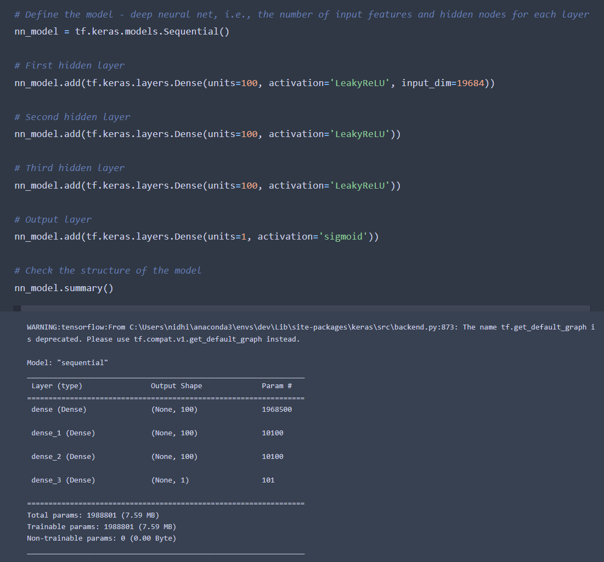
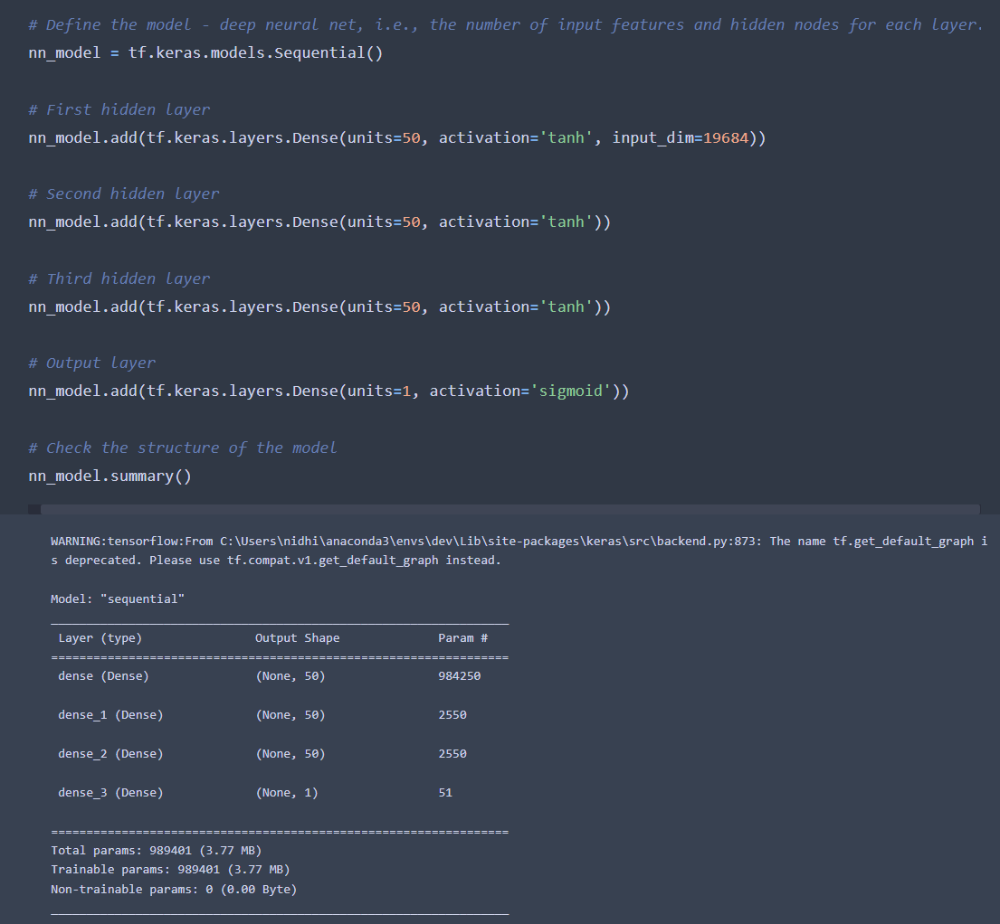
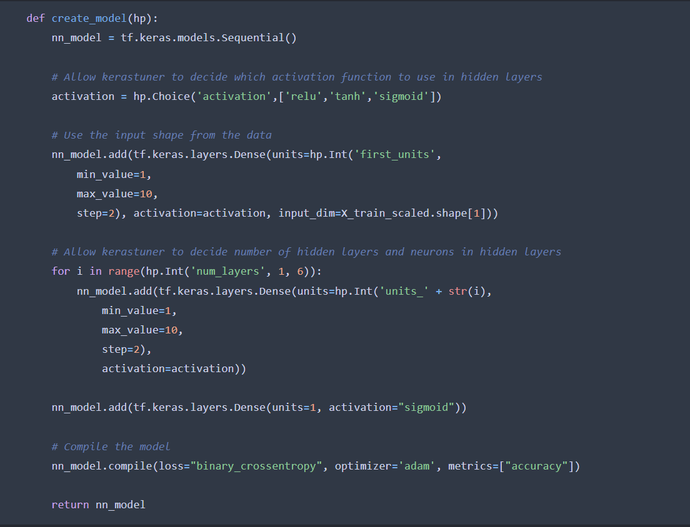
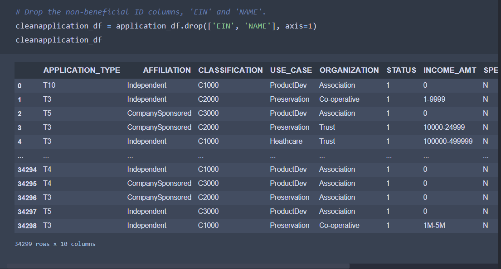
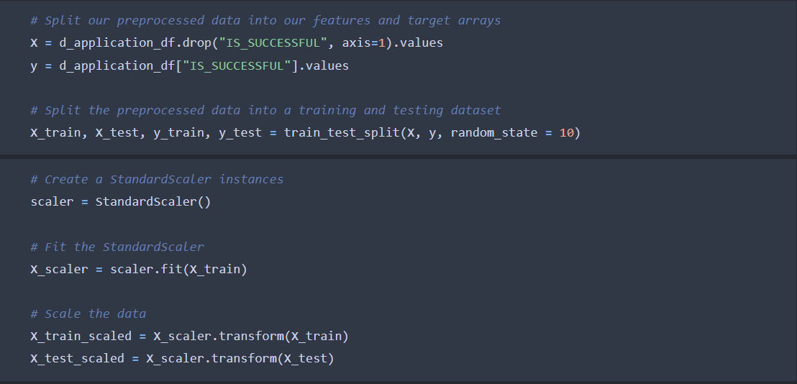

# Module 21 Challenge: Neural Networks and Deep Learning - AlphabetSoupCharity Funding Analysis

## Purpose

In this challenge, we'll use a deep learning model, to create a binary classification model that can predict if an Alphabet Soup-funded organization will be successful based on the features in the dataset. We will be using machine learning and neural networks to analyze a CSV containing over 34,000 organizations that have received funding from Alphabet Soup, using metadata columns to predict the success of future applicants.

### Key Artifacts and Solution

- [Jupyter Notebook for Initial Model](#AlphabetSoupCharity.ipynb)
- [Jupyter Notebook for Best Optimized Model](#AlphabetSoupCharity_Optimization3.ipynb)
- [Final_Analysis and Report on the Neural Network Model](#AlphabetSoupCharity_Funding AnalysisReport.md)

## Data Preprocessing

- What variable(s) are the target(s) for your model?
    - The target for each model was the IS_SUCCESSFUL column. The ultimate goal is to predict which applicants will be successful, so we will utilize all other features to ultimately make a predict
- What variable(s) are the features for your model?
    - The available features for my model are: EIN, NAME, APPLICATION_TYPE, AFFILIATION, CLASSIFICATION, USE_CASE, ORGANIZATION, STATUS, INCOME_AMT, SPECIAL_CONSIDERATIONS, and ASK_AMT
- What variable(s) should be removed from the input data because they are neither targets nor features?
    - In the first model I ran I removed the EIN column and the NAME columns as instructed. In the first attempt at optimization, I added the NAME column back in case there was any bias to any specific organizations, as there where many that where listed multiple times. 

#### Compiling, Training, and Evaluating the Model
- How many neurons, layers, and activation functions did you select for your neural network model, and why?

    - In the first model, I used 2 hidden layers with 100 neurons each utilizing the ReLU activation. For the output layer the Sigmoid activation was used. I chose ReLU as I could immediately identify by looking at my data that it was non-linear, so I felt that would be the optimal activation to begin with.

        
    - In the second model, I attempted to use the LeakyReLU activation as ReLU was unsuccessful. On of my observations from the first model is that the accuracy and loss did not change much from the first epoch to the last. It was as though it stopped learning, which I've learned LeakyReLU introduces measures to prevent dead neurons so the model can continue learning. In this first optimization I added a third hidden layer, and each of the 3 layers had 100 neurons each. Sigmoid was also used here as the output activation.

        
    
    - In the third model, I chose to attempt using the Tanh activation. Tanh is also a non-linear activation so I wanted to allow an attempt. I was unsure it would be the best option, and at this point I am experimenting with different activations to try and increase model accuracy.I did 3 hidden layers with 50 neurons each. I chose 50 because the prior model ran into an overfitting issue.

        

    - In my fourth and final model, I chose auto-optimization to get the best model and hyperparameters to obtain accuracy higher than 75%. auton-optimaization chose. This model has 3 layers, with the first layer having 5 neurons and the remaining layers having 7, 9, 7, 3, and 9 neurons respectively. The activation function used throughout this model is sigmoid.

        
- Were you able to achieve the target model performance?
    - I was successful in my 3rd optimizatio in achieving a target model performance of 75% or higher in all attempts, including my initial model and 3 different optimizations.

- What steps did you take in your attempts to increase model performance?
    - In my first optimization I added a third hidden layer, and utilized LeakyRelu algorithm instead of Relu which I used in the first attempt.

### Alternative Solutions

I believe a random forest could work well for this problem because it is a type of machine learning that excels at grouping, and could likely help predict funding for organizations. Also random forests work by combining many decision trees together, which can help to prevent overfitting which was an issue I encountered.

## Technical Skills
- Machine learning
- Deep learning
- Neural networks
- Tensorflow
- Pandas
- Python
- Statistical analysis  

## Project Parameters

### Preprocess the Data
- Create a dataframe containing the charity_data.csv data, and identify the target and feature variables in the dataset
- Drop the EIN and NAME columns 
- Determine the number of unique values in each column
- For columns with more than 10 unique values, determine the number of data points for each unique value
- Create a new value called Other that contains rare categorical variables
- Create a feature array, X, and a target array, y by using the preprocessed data
- Split the preprocessed data into training and testing datasets
- Scale the data by using a StandardScaler that has been fitted to the training data 

### Compile, Train and Evaluate the Model

- Create a neural network model with a defined number of input features and nodes for each layer
- Create hidden layers and an output layer with appropriate activation functions
- Check the structure of the model
- Compile and train the model
- Evaluate the model using the test data to determine the loss and accuracy 
- Export your results to an HDF5 file named AlphabetSoupCharity.h5

### Optimize the Model
- Repeat the preprocessing steps in a new Jupyter notebook
- Create a new neural network model, implementing at least 3 model optimization methods
- Save and export your results to an HDF5 file named AlphabetSoupCharity_Optimization*.h5
- I have been able to achieve the accuracy of more than 75% in the 4th optimization model 

### Write a Report on the Neural Network Model

- Write an analysis that includes a title and multiple sections, labeled with headers and subheaders
- Format images in the report so that they display correction
- Explain the purpose of the analysis
- Answer all 6 questions in the results section
- Summarize the overall results of your model
- Describe how you could use a different model to solve the same problem, and explain why you would use that model

## Analysis
After four models being tested, model 4 which used auto-optimization had the highest accuracy against the test data at .79, surpassing the 75% accuracy goal. With that, it still had a high loss percentage of .53.

The first model had a lower accuracy at .72, but a higher loss percentage of .59. It used 2 hidden layers with 100 neurons each utilizing the ReLU activation, with a Sigmoid activation for the output layer. The choice of ReLU was based on the observation that the data was non-linear.

In the second model, LeakyReLU activation was used to address the issue of dead neurons preventing further learning. The model had 3 hidden layers with 100 neurons each, and a Sigmoid activation for the output layer. While the training accuracy was high at .96, the accuracy against the test data was lower at .60 which is a sign of overfitting.

The third model used the Tanh activation in an attempt to increase model accuracy. It had 3 hidden layers with 50 neurons each, I lowered the neurons to try and avoid overfitting but was unsuccessful. The model accuracy against the test data was lower than model 4 at .67.

Overall, the best performing model was model 4 though it still had a high loss percentage.